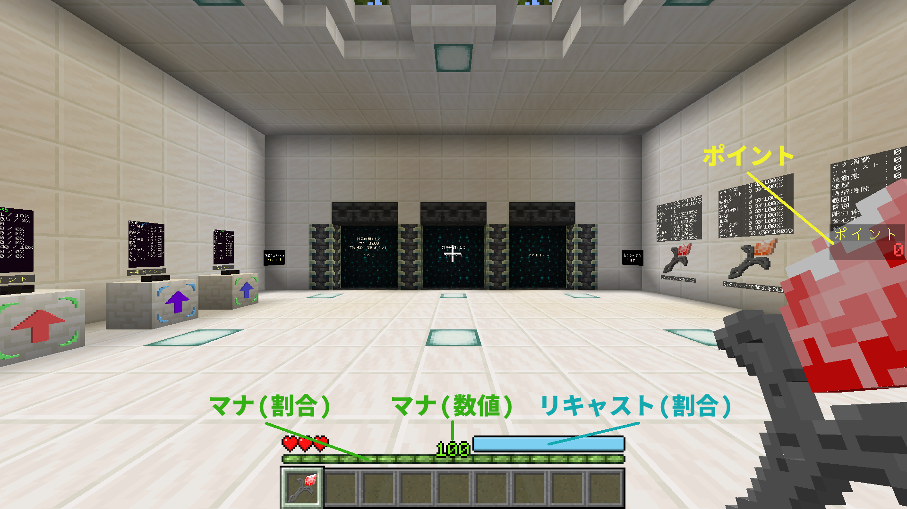
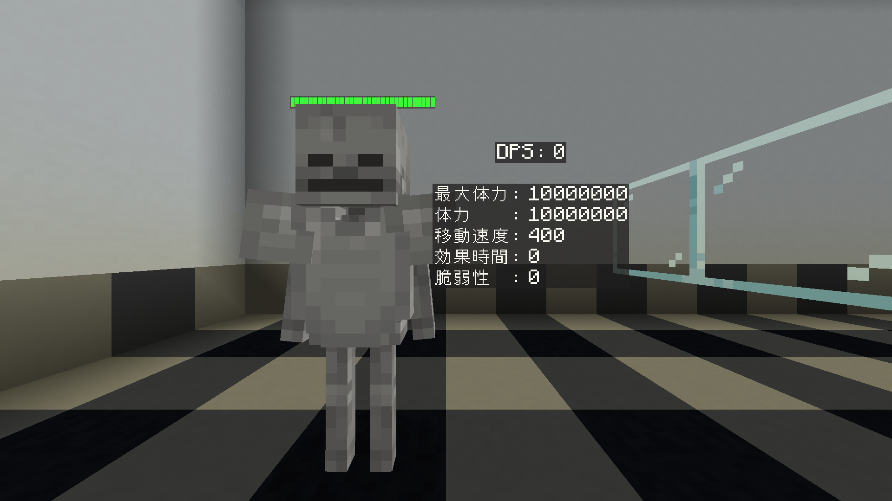

# Modirodについて
　Modirodは自由自在に内容を編集できる杖を駆使し、全10体存在するボスを討伐することが目標のゲームです。  
　プレイヤーはボスを討伐できる杖を作成するため、様々な方法で杖を強化していきます。  
　ポイントを貯めてアイテムを購入したり...  
　ウェーブを進めてボーナスを得たり...  
　さらなる強化アイテムを求めて賭けてみたり...  
　コンテンツに触れながら、少しずつ強くなっていきましょう。 

## ゲームの流れ
　プレイヤーはゲームを開始するとロビーに移動します。  
　初期アイテムとして、杖と構成要素が配布されます。  
　ロビーではアイテムの購入や杖の編集、施設の利用や各ステージへの移動などが行えます。  
　まずは入手した構成要素を杖に設定し、テストルームで試し撃ちをしてみましょう。  
　準備ができたら、ウェーブに挑戦してポイントを稼ぎ、杖をさらに強化していきます。  
　十分強くなったと感じたら、ボスの討伐へ挑みましょう。  

　おっと！死んでしまった？  
　Modirodは油断すると簡単に死んでしまうゲームです。  
　しかし、死ぬたびにすべてがリセットされるわけではありません。  
　引継ぎで次の自分へ託しましょう。  

　プレイヤーは死亡すると、次のゲームに持ち越すアイテムを選ぶことができます。  
　アイテムを吟味して次のゲームを有利に進めましょう。  

　Modirodはやればやるほど強くなれるゲームです。  
　自分だけの最強の杖を作り上げ、全ボス撃破を目指しましょう。  

# プレイヤーの情報について
  
  
  - ポイント  
    敵を倒すことで入手できる通貨です。  
  - マナ  
    魔法発動に必要です。  
    杖が必要とするマナがない場合は魔法が発動できません。  
    各杖共通のステータスです。  
  - リキャスト  
    魔法発動後、その杖が再度魔法を発動できるまでの時間を意味します。  
    マナと異なり、各杖ごとに存在します。  
    メインハンドに持つ杖を変えることで画面上の表示も切り替わります。
    
# 敵の情報について
  
  
  - 体力  
    魔法によって減少させることができます。  
    0以下になると死亡します。  
  - 移動速度  
    値が増加すると移動速度が上昇します。  
    0にすると移動できなくなります。  
    移動速度の値操作は効果時間が1以上のときに有効です。  
  - 効果時間  
    移動速度または脆弱性の値操作の有効時間です。  
    値が1以上の時、0.05秒で1減少します。  
    0になると移動速度と脆弱性は元の値に戻ります。  
  - 脆弱性  
    値が増加すると体力が減少しやすくなります。  
    脆弱性の値操作は効果時間が1以上のときに有効です。  
    
# 構成要素について
　構成要素を杖に設定することで杖の能力値と効果を変えることができます。  
　構成要素は19項目の能力値と最大3つの影響を持ちます。  

　能力値はマナ、リキャスト、発動数、速度、持続時間、範囲、貫通、能力係数、会心率、会心倍率の9種類あります。  

| 能力値 | 説明 |
| :---: | --- |
| マナ | 魔法発動時に必要なマナ |
| リキャスト | 魔法発動後に再発動できるようになるまでの時間 |
| 発動数 | 魔法発動時に出現する魔法弾の数 |
| 速度 | 魔法弾の飛翔速度 貫通後値は80%になる |
| 持続時間 | 魔法弾が消滅するまでの時間 貫通後値は80%になる |
| 範囲 | 魔法弾の当たり判定 貫通後値は80%になる |
| 貫通 | 魔法弾が貫通する回数 |
| 能力係数 | 様々な魔法の効果量に影響する値 貫通後値は80%になる |
| 会心率 | 会心が発生する確率 100以上で確定会心になる |
| 会心倍率 | 会心発生時の倍率 |
 
　発動数を除いた各項目ごとに固定値と割合値があります。  

　影響は杖の効果に反映されます。  
　中には杖ではなく構成要素自身に反映される影響も存在します。  

# 杖の編集について
　ロビーにある杖オブジェクトを右クリックすると、杖インベントリを開くことができます。  
　杖インベントリに構成要素を配置することで、構成要素の能力値や影響を杖に反映させることができます。  
　杖の能力値は杖オブジェクト上部に表示されます。また、アイテムとして所持している杖をメインハンドに持った状態でスニーク+右クリックすることで、杖の効果が確認できます。  
　杖インベントリに配置された構成要素は1段目の左から右、2段目の左から右。3段目の左から右の順に読み込まれます。  
　各構成要素の影響は上から順に読み込まれます。  
　杖の効果に対する影響は重複して反映されず、競合する影響は後に読み込まれた構成要素のものが優先されます。  

# 施設について

## 売却
　売値が設定されているアイテムを売却することができます。  

## 強化
　強化本とポイントを消費することで、構成要素の能力値を変化させることができます。  
　消費するポイントは強化する構成要素の強化回数によって変動します。  
| 強化回数 | 消費ポイント |
| --- | --- |
| 0~24 | 0ポイント |
| 25~48 | 1ポイント |
| 49~72 | 2ポイント |
| 73~96 | 3ポイント |
| 97~120 | 4ポイント |
| 121~ | 5ポイント |

## 鑑定
　ポイントを消費することで、未鑑定の構成要素を鑑定することができます。  
　ウェーブ突破実績を進めることで、レアリティの高い構成要素を入手できる確率が上昇します。  

## 新生
　構成要素とポイントを消費することで、新たな構成要素を入手することができます。  
　新生する構成要素の売値によって消費するポイントは変化します。  
　消費ポイントは`左側に配置した構成要素の売値*右側に配置した構成要素の売値*5`で計算されます。  
　ウェーブ突破実績を進めることで、抽選されなかった影響が影響の欠片として入手できる確率が上昇します。  
　名前と見た目は左側に配置した構成要素に依存します。  
　能力値は平均、左側、右側、加算のいずれかの値になります。  
　影響は両方の構成要素からランダムに付与されますが、両方の構成要素にある影響は確定で付与されます。  

## 抽出
　構成要素を消費することで、確率で影響の欠片を入手することができます。  
　ウェーブ突破実績を進めることで、影響の欠片が入手できる確率が上昇します。  

## 付与
　影響の欠片を消費することで、任意の影響を持った構成要素を入手することができます。  
　影響を付与するには影響の欠片が3つ必要です。  

# ウェーブについて
　ウェーブステージへはロビーから移動できます。  
　出現した複数の敵を倒すことでポイントやアイテムを入手することができます。  
　ウェーブは500段階存在し、10ウェーブごとに精鋭が出現します。  
　ステージにいる間、プレイヤーはダッシュとジャンプができなくなりますが、1ブロックの段差は無視できる状態になります。  
　制限時間が終了する、もしくはウェーブに出現する敵を全て討伐し、アイテムを全て拾うことでそのウェーブはクリアとなり、終了します。  
　ウェーブに出現する敵を全て討伐した場合は制限時間が終了するまで、ステージに存在するアイテムが常にプレイヤーの場所に転移します。  
　ウェーブに出現する敵を全て討伐してウェーブを終了した場合は追加のポイントが得られます。  
　ドロップしたポイントやアイテムは制限時間内に拾わないと消滅します。  
　ウェーブクリア後はポイントを消費することでプレイヤーのステータスを上昇させることができます。  

# ボスについて
　ボスステージへはロビーから移動できます。  
　出現したボスを倒すことで報酬を得ることができます。  
　ボスは10段階存在します。  
　ステージにいる間、プレイヤーはダッシュとジャンプができなくなりますが、1ブロックの段差は無視できる状態になります。  
　制限時間が終了すると討伐失敗となり、ロビーに移動します。  
　ボスを討伐するとロビーに移動し、報酬が得られます。  

# 引継ぎについて
　プレイヤーが死亡、またはゲームをクリアすることで引継ぎを行うことができます。  
　引継ぎ設定場所では、杖インベントリと倉庫にもアクセスすることができます。  
　引継ぎインベントリに配置したアイテムは、次回のゲーム開始時に配布されます。  
　引継ぎできるアイテムスロットには制限があり、ウェーブ突破実績を進めることで引継ぎ可能スロットが増えていきます。  
